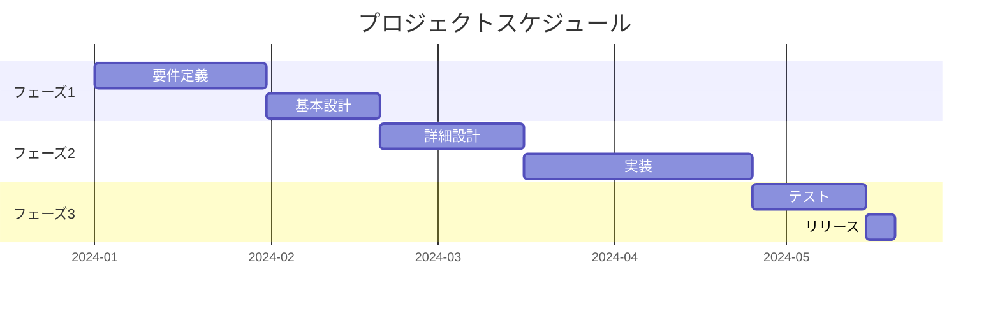
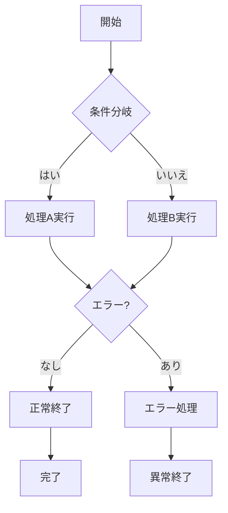
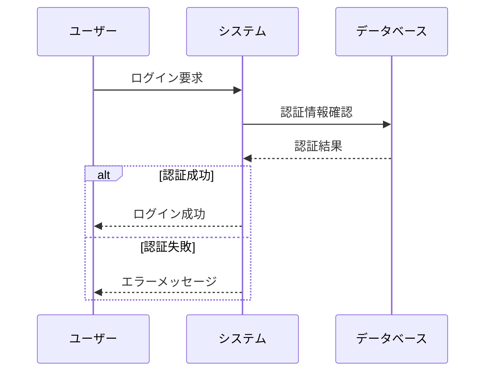
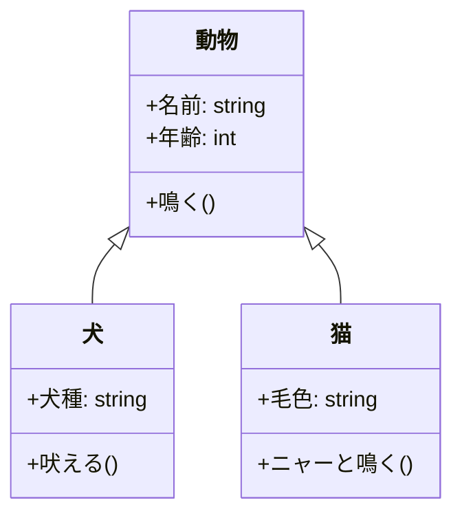

# サンプルドキュメント

このドキュメントは、Markdown to PDF Containerの動作確認用サンプルです。

## テキストの装飾

**太字**、*イタリック*、~~取り消し線~~などの基本的な装飾が使用できます。

- リスト項目1
- リスト項目2
  - ネストしたリスト
  - サブ項目

1. 番号付きリスト
2. 2番目の項目
3. 3番目の項目

## コードブロック

```python
def hello_world():
    print("Hello, World!")
    return True

if __name__ == "__main__":
    hello_world()
```

## Mermaid図表の例

### ガントチャート



### フローチャート



### シーケンス図



### クラス図



## 引用

> これは引用文です。
> 複数行にわたって記述できます。
>
> 引用の中に段落を含めることもできます。

## テーブル

| 項目 | 説明 | 価格 |
|------|------|------|
| 商品A | 高品質な商品 | ¥1,000 |
| 商品B | お手頃価格 | ¥500 |
| 商品C | プレミアム品 | ¥2,000 |

## まとめ

このドキュメントでは、以下の機能を確認できます：

1. 日本語テキストの表示
2. Markdown基本構文のサポート
3. Mermaid図表の埋め込み（ガント、フロー、シーケンス、クラス）
4. コードブロックのシンタックスハイライト
5. テーブル、リスト、引用などの要素

PDFが正常に生成されれば、すべての機能が動作していることを意味します。
